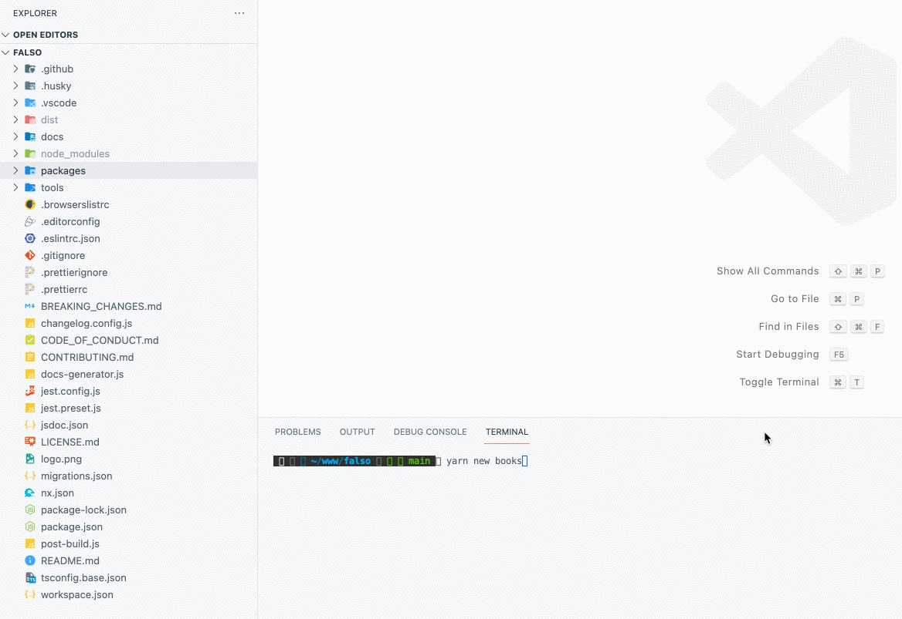

<p align="center">
 
</p>

> All the Fake Data for All Your Real Needs 🙂

Create massive amounts of fake data in the browser and NodeJS. Tree Shakeable & Fully Typed.

<hr />

<p align="center">

[](https://github.com/ngneat/falso/actions/workflows/ci.yml)
[]()
[]()
[](CODE_OF_CONDUCT.md)
[](https://github.com/semantic-release/semantic-release)
[](https://github.com/prettier/prettier)

</p>

✅ &nbsp;202 Functions  
✅ &nbsp;Tree Shakable  
✅ &nbsp;Fully Typed  
✅ &nbsp;Factory Functions  
✅ &nbsp;Entity Functions  
✅ &nbsp;Single and Array Result

🤓 Learn about it on the [docs site](https://ngneat.github.io/falso/) <br>

## StackBlitz

[](https://stackblitz.com/edit/typescript-pj5epp?file=index.ts)

## Installation

```
npm i @ngneat/falso
yarn add @ngneat/falso
```

### Usage

```ts
import { randEmail, randFullName } from '@ngneat/falso';

const user = { email: randEmail(), name: randFullName() };

const emails = randEmail({ length: 10 });
```

You can specify the length of elements you want to generate. Below is an example of generating 10 emails with length equal or smaller than 20 characters.

```ts
const emails = randEmail({ length: 10, maxCharCount: 20 });
```

### Setting a Randomness Seed

You can set your own seed if you want consistent results:

```ts
import { rand, seed } from '@ngneat/falso';

seed('some-constant-seed');

// Always returns 2
rand([1, 2, 3, 4, 5]);

// Reset random seed
seed();
```

## Contribute

- Go over the steps in [this](https://github.com/firstcontributions/first-contributions) guide
- Add a new falso



- Use `npm run c` and choose the right answers

<div>Icons made by <a href="https://www.freepik.com" title="Freepik">Freepik</a> from <a href="https://www.flaticon.com/" title="Flaticon">www.flaticon.com</a></div>
